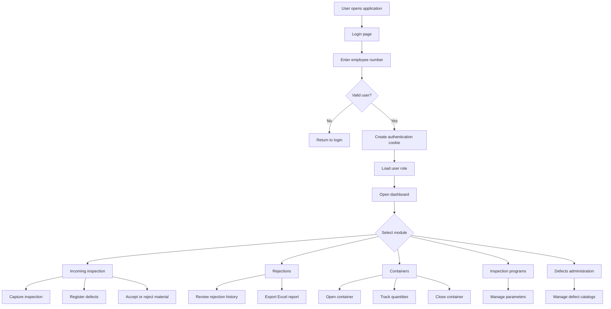
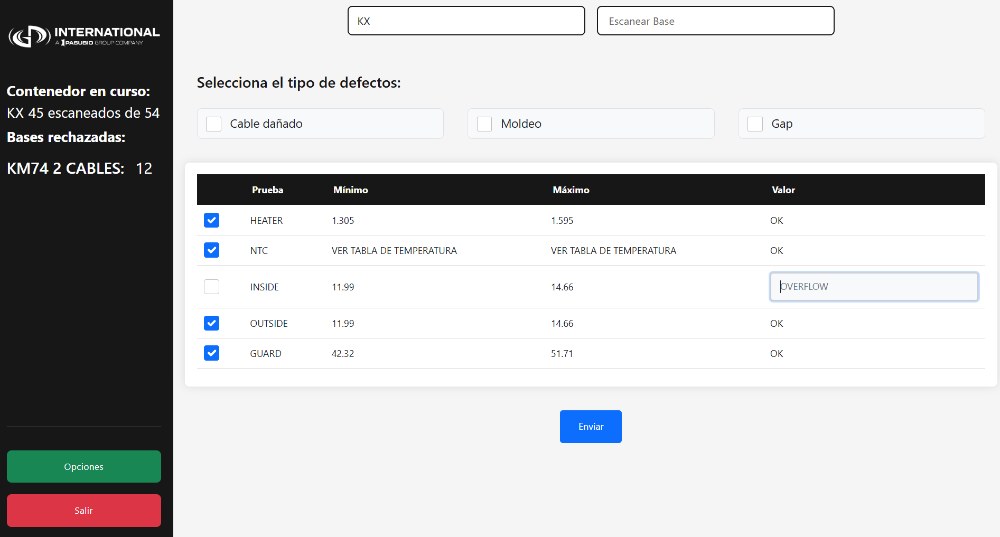
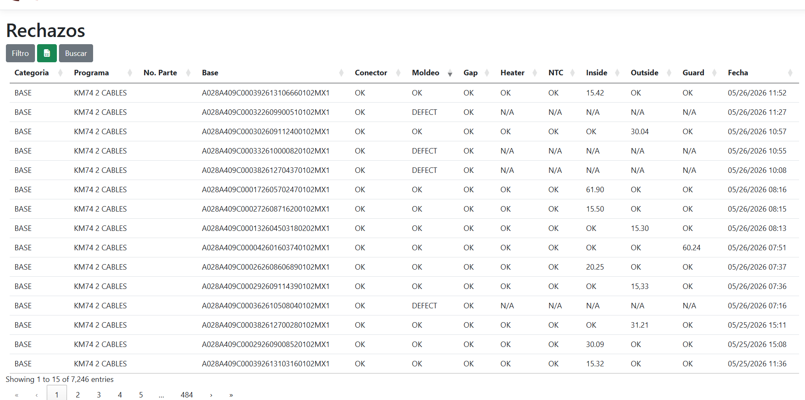
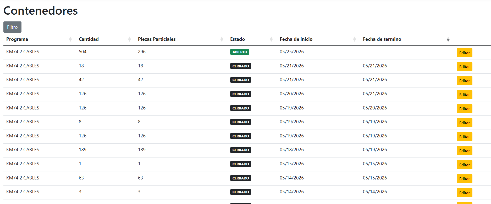
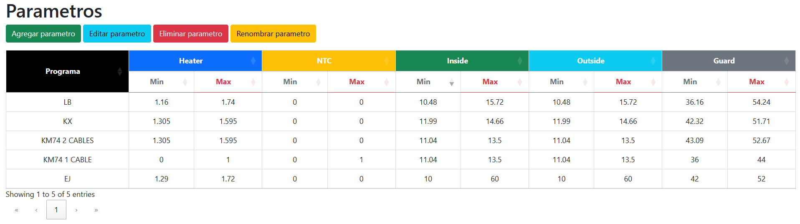

# Incoming Inspection Management System

Web application developed with **ASP.NET Core MVC (.NET 8)** for managing incoming inspection workflows, rejected materials, accepted pieces, containers, inspection parameters, and manufacturing quality traceability processes.

---

## Overview

`Incoming` is a manufacturing quality inspection platform designed to support incoming material validation and rejection workflows inside industrial environments.

The system centralizes inspection capture, defect registration, container management, accepted material tracking, and Excel reporting while controlling access through role-based authentication.

The platform integrates directly with SQL Server and provides operational modules used by inspectors, supervisors, and administrators.

---

## Technologies

- `.NET 8`
- `ASP.NET Core MVC`
- `Entity Framework Core`
- `SQL Server`
- `ClosedXML`
- `Bootstrap`
- `jQuery`
- Modular JavaScript architecture

---

## Main Features

### Incoming Inspection Workflow

- Incoming inspection registration
- Inspection scan capture
- Accepted piece tracking
- Rejected material management
- Electrical and visual defect registration
- Inspection parameter validation

---

### Rejection Management

- Rejection registration and editing
- Conversion of rejected material into accepted pieces
- Historical rejection tracking
- Filtered rejection dashboards
- Excel export support

---

### Container Management

- Open container management
- Partial quantity tracking
- Container closing workflows
- Container traceability

---

### Inspection Administration

Users can manage:

- Inspection programs
- Inspection parameters
- Defect catalogs
- Users and roles
- Finished goods rejection records

---

### Reporting and Exporting

- Excel report generation using `ClosedXML`
- Template-based reporting
- Filtered exports
- Manufacturing quality traceability reports

---

### Authentication and Authorization

- Employee number login
- Cookie-based authentication
- Role-based access control
- Session management

---

## User Roles

| Role | Access |
|---|---|
| `ADMINISTRATOR` | Full system administration |
| `SUPERVISOR` | Operational access to inspection workflows |
| `USER` | Inspection capture and limited operational access |

---

## Application Architecture

The application follows a layered MVC architecture using Entity Framework Core and modular frontend scripts.

```text
Incoming/
|-- Controllers/        MVC controllers and AJAX endpoints
|-- Data/               EF Core DbContext configuration
|-- DTO/                Data transfer objects
|-- Models/             Entities and database views
|-- Scripts/            SQL helper scripts
|-- Views/              Razor views
|-- wwwroot/            CSS, JS, assets, and Excel templates
|-- Program.cs          Application startup configuration
```

---

## System Flow Diagram



---

## Main Modules

### Home

Main operational inspection screen used for incoming inspection capture workflows.

Main capabilities:

- Inspection registration
- Scan capture
- Defect tracking
- Accepted piece registration
- Inspection workflow management

---

### Rejections

This module supports rejection registration, editing, filtering, and reporting workflows.

Main capabilities:

- Rejection registration
- Rejection editing
- Historical tracking
- Excel export
- Quality traceability

---

### Rejection Material Dashboard

Operational dashboard for reviewing and filtering rejected materials.

Main capabilities:

- Multi-field filtering
- Date range search
- Excel export
- Inspection reporting

---

### Finished Goods

This module manages rejected finished goods during incoming inspection workflows.

---

### Containers

Container management module for operational traceability.

Main capabilities:

- Container creation
- Partial quantity tracking
- Container closing workflows
- Production traceability support

---

### Inspection Programs and Parameters

Administrative modules used to maintain inspection rules and validation parameters.

---

### Defects Administration

Defect catalog administration for electrical and visual inspection workflows.

---

## Database Integration

The platform integrates with SQL Server using Entity Framework Core.

Main entities include:

- `Users`
- `InspectionPrograms`
- `Parameters`
- `Rejections`
- `AcceptedPieces`
- `Containers`
- `Finishedgoods`
- `Defects`

The application also consumes database views for reporting and operational workflows.

---

## Visual Workflow

### Incoming Inspection Capture

Inspectors can capture inspected materials, register defects, and classify accepted or rejected pieces directly from the operational screen.



---

### Rejection Dashboard

Supervisors can review rejection history, apply filters, and export operational quality reports.



---

### Container Management

The system supports operational tracking of open and closed inspection containers.



---

### Inspection Parameters

The system allows users to review and manage inspection parameters by program.



---

## Excel Templates

The application uses predefined Excel templates for operational reporting:

- `base_report.xlsx`
- `finishedgood_report.xlsx`

---

## Operational Notes

- The application includes an operational shutdown endpoint used in production environments.
- Inspection workflows include support for special inspection programs such as `EJ` and `KM`.
- Authentication uses cookie sessions with extended expiration times.
- Excel reports depend on templates stored in `wwwroot`.

---

## Key Features

- Manufacturing incoming inspection workflows
- Rejected material tracking
- Accepted piece management
- Container traceability
- SQL Server integration
- Excel reporting support
- Role-based authentication
- Inspection parameter management
- ASP.NET Core MVC architecture

---

## Project Purpose

This repository is part of my software engineering portfolio and represents a real-world manufacturing quality inspection platform used for incoming material validation, defect tracking, and industrial quality control workflows.
